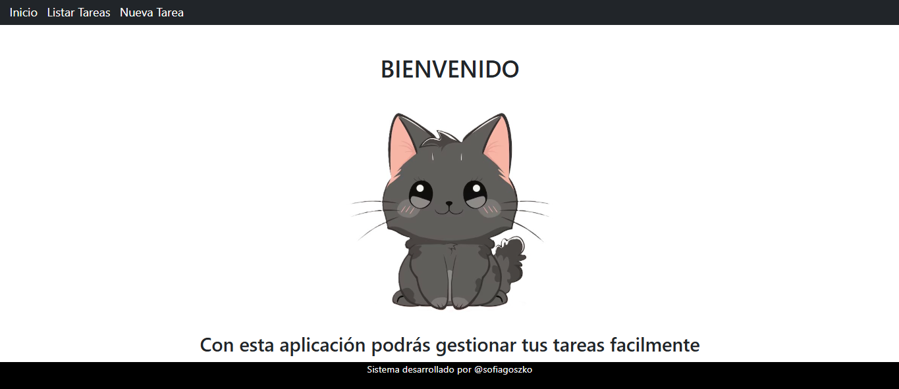
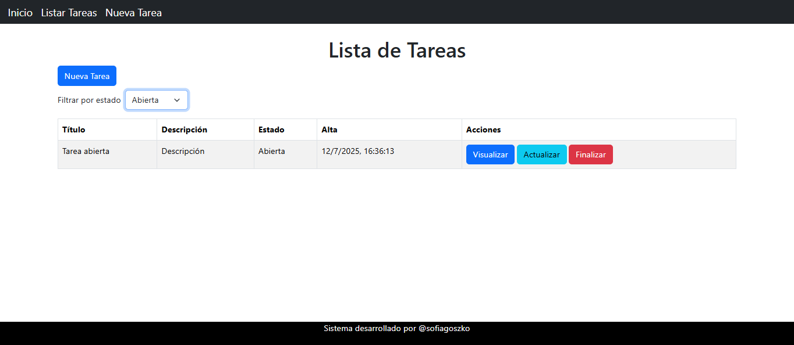
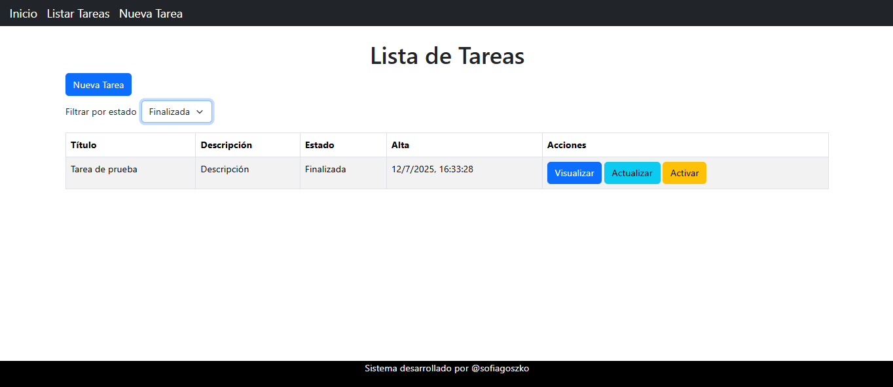

# Challenge ingreso a Academia ForIT 2025

## Objetivo
Crear una aplicación básica de lista de tareas que demuestre conocimientos fundamentales de Git, JavaScript, Node.js y React.

## Requisitos
- Crear un repositorio público en GitHub (o similar) para el proyecto
- Crear una carpeta para el backend
- Crear carpeta para el frontend
- Crear un servidor básico con Express
- Implementar los siguientes endpoints:
    - GET /api/tasks - Obtener todas las tareas
    - POST /api/tasks - Crear una nueva tarea
    - PUT /api/tasks/:id - Actualizar una tarea existente
    - DELETE /api/tasks/:id - Eliminar una tarea
- Usar un array en memoria como almacenamiento temporal
- Implementar manejo básico de errores
- Crear una aplicación de React con Vite (o similar)
- Implementar los siguientes páginas/componentes (usando algún router):
    - TaskList - Muestra la lista de tareas
    - TaskItem - Muestra una tarea individual
    - TaskForm - Formulario para crear/editar tareas
- Implementar llamadas a la API de express usando fetch
- Configurar variables de entorno tanto para la api como el frontend
- Usar CSS básico para darle estilo a la aplicación

## Correr la aplicación por primera vez

1. Clonar el repositorio
2. En la carpeta del backend, crea un archivo *.env* con la variable

```
PORT=numero-de-puerto
```
3. En la carpeta del frontend, crea un archivo *.env* con la variable 

```
VITE_API_URL=http://localhost:numerp-de-puerto/api
```

4. Desde una terminal

```
cd backend
npm install
npm run dev
```

5. Desde otra terminal

```
cd frontend
npm install
npm install sweetalert2
npm run dev
```

## Correr la aplicación ya descargada

1. Desde una terminal

```
cd backend
npm run dev
```

6. Desde otra terminal

```
cd frontend
npm run dev
```

> Por el momento las tareas no se guardan en una base de datos, por lo que toda la información guardada se pierde al tirar la aplicación


## Aplicación andando

### Home


### Listar tareas


### Crear tarea
- Formulario para crear una tarea


- Validaciones en el frontend


- Validaciones en el backend


- Mensaje de éxito


- Listado de tareas con la nueva tarea creada


### Editar tarea
- Formulacio para editar la tarea


- Mensaje de éxito


- Listado de tareas con la tarea editada


### Visualizar una tarea


### Finalizar una tarea
- Pregunta antes de finalizar una tarea


- Mensaje de éxito


- Listado de tareas con la tarea finalizada


### Filtrar de tareas

- Listado de tareas sin filtrar


- Tareas abiertas


- Tareas finalizadas
